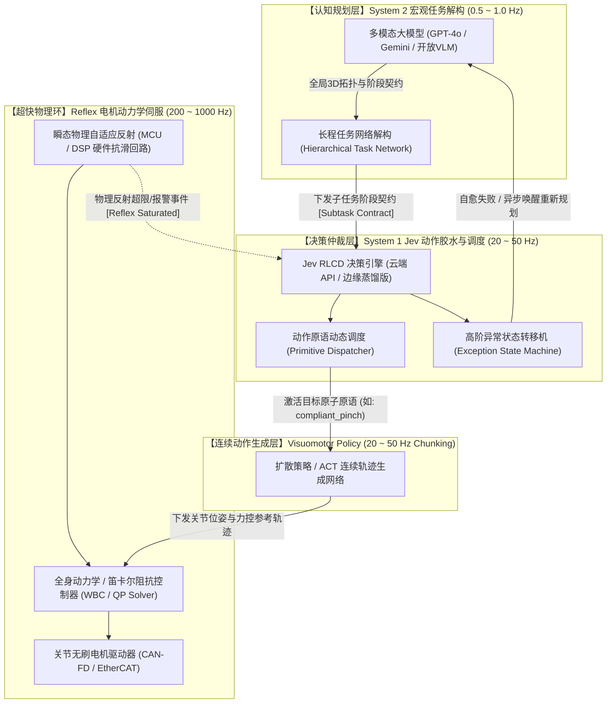
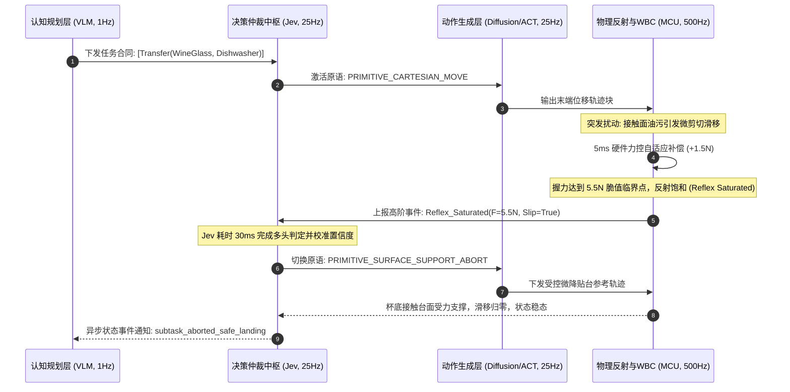

<div align="center">

**[English](./README_EN.md) | 简体中文**

# The Missing Middle: 基于 System 1 决策模型的具身智能分层控制架构白皮书

### *A Technical Blueprint for Bridging Semantic VLM Planning and Motor Control via Calibrated Decision Models*

[](./LICENSE)
[](https://docs.ros.org/)
[](#3-系统架构设计多环混合控制系统hierarchical-architecture)
[](#8-引用与项目规范citation)

**Author**: `regou`  
**Domain**: Embodied AI · Hierarchical Control Theory · Real-Time Robotics · System 1 Decision Models  
**Version**: `v1.3.0-Technical-RFC` (September 2026)

</div>

---

## 摘要（Abstract）

在具身智能（Embodied AI）向开放物理世界落地的演进中，系统架构面临一道核心工程瓶颈——**“控制断层”（The Control Chasm）**：
* **顶层多模态认知模型（VLM/LLM）** 具备丰富的开放世界常识与长程规划能力，但单次推理耗时高达 1000 ~ 3000 ms，且自回归文本输出存在随机幻觉与非确定性漂移，无法接入高频运动闭环；
* **底层运动控制与反射回路（WBC/阻抗控制/MCU）** 运行在 200 ~ 1000 Hz，具备敏捷动力响应，但缺乏语义感知，仅能处理局部的数值物理闭环；
* **中间动作生成策略（Diffusion Policy / ACT）** 运行在 10 ~ 50 Hz，但策略泛化边界脆弱，缺乏多阶段任务切换与异常恢复能力；
* 传统补救方案中，人工静态**行为树（Behavior Trees）**在非结构化现实中极易条件断裂，而直接调用大模型做函数调用（Tool Calling）则受困于灾难性的网络与自回归时延。

2026 年 9 月，由前 OpenAI 核心科学家、RLHF 共同发明人 Diogo Almeida 创立的 TypeSafe AI 推出了首个面向决断而非文本生成的 System 1 模型 **Jev**。Jev 确立了 **“Decisions, not strings”** 范式，基于 **RLCD（校准决策强化学习）** 实现了极低延迟结构化求值、输出真实校准置信度、消除语法格式漂移与单前向并行状态评估。

本文提出并形式化定义了 **“多环分层混合具身架构”（Hierarchical Hybrid Control Architecture）**，系统性论证了以 Jev 为代表的 System 1 决策模型作为**“动作胶水与仲裁中枢”**的技术必然性：
1. **慢认知环（0.5 ~ 1.0 Hz）**：由 VLM 负责全局 3D 语义建图与长程分层任务网络（HTN）解构；
2. **快决策环（20 ~ 50 Hz）**：由 Jev 决策引擎（云端或边缘蒸馏版）作为中枢，负责传感器状态特征融合、动作原语（Skill Primitives）动态路由与高阶动作自愈；
3. **连续轨迹层（20 ~ 50 Hz Chunking）**：由扩散策略（Diffusion Policy）或 ACT 生成动作轨迹块；
4. **超快物理环（200 ~ 1000 Hz）**：由 WBC 阻抗控制器与驱动器负责瞬态物理反射与电机力矩伺服。

通过在家庭长程操作（包括红酒杯物理反射超限时的多策略仲裁）等高动态场景下的理论延迟预算分析与全链路架构推演，本架构确立了兼顾 AI 泛化力与确定性高频动作调度的标准化系统范式。

---

## 目录（Table of Contents）

- [1. 问题背景：具身智能的“控制断层”（The Control Chasm）](#1-问题背景具身智能的控制断层the-control-chasm)
  - [1.1 现有主流技术范式的物理局限与权衡](#11-现有主流技术范式的物理局限与权衡)
  - [1.2 传统中间胶水层的失败根源](#12-传统中间胶水层的失败根源)
- [2. Jev 技术机理：面向决断的 System 1 模型](#2-jev-技术机理面向决断的-system-1-模型)
  - [2.1 “Decisions, Not Strings” 计算图变革](#21-decisions-not-strings-计算图变革)
  - [2.2 RLCD 置信度校准机制](#22-rlcd-置信度校准机制)
  - [2.3 单前向并行求值机制与因果掩码](#23-单前向并行求值机制与因果掩码)
- [3. 系统架构设计：多环混合控制系统（Hierarchical Architecture）](#3-系统架构设计多环混合控制系统hierarchical-architecture)
  - [3.1 架构数据流图解](#31-架构数据流图解)
  - [3.2 四层控制分工与频率解耦](#32-四层控制分工与频率解耦)
  - [3.3 动作路由与动态换挡准则](#33-动作路由与动态换挡准则)
- [4. 标杆场景推演：物理反射饱和与高阶语义自愈](#4-标杆场景推演物理反射饱和与高阶语义自愈)
  - [4.1 任务设定：易碎高脚杯转移与油污扰动](#41-任务设定易碎高脚杯转移与油污扰动)
  - [4.2 底层力控反射与 Jev 语义自愈的分工时序](#42-底层力控反射与-jev-语义自愈的分工时序)
  - [4.3 控制时序交互图（Sequence Diagram）](#43-控制时序交互图sequence-diagram)
- [5. 接口规范与系统集成设计](#5-接口规范与系统集成设计)
  - [5.1 强类型数据契约（Data Contracts）](#51-强类型数据契约data-contracts)
  - [5.2 核心仲裁机制与集成架构](#52-核心仲裁机制与集成架构)
- [6. 边缘计算部署与综合技术范式对比](#6-边缘计算部署与综合技术范式对比)
  - [6.1 部署形态演进：从云端 API 到边缘蒸馏（Distillation Path）](#61-部署形态演进从云端-api-到边缘蒸馏distillation-path)
  - [6.2 综合控制范式对比矩阵](#62-综合控制范式对比矩阵)
- [7. 总结与未来演进路线（Roadmap）](#7-总结与未来演进路线roadmap)
- [8. 引用与项目规范（Citation）](#8-引用与项目规范citation)

---

## 1. 问题背景：具身智能的“控制断层”（The Control Chasm）

在通用机器人（General-Purpose Robots）的控制软件栈中，长期存在着“认知-物理两极割裂”：

```
┌──────────────────────────────────────────────────────────────┐
│                  【顶层认知层】VLM / LLM                     │
│      开放世界常识、3D拓扑理解、长程语言任务分解 (0.5 ~ 1.0 Hz)      │
└──────────────────────────────┬───────────────────────────────┘
                               │ 
                               │ ❌ 控制断层 (The Missing Middle)
                               │    • 1000ms+ 延迟无法响应突变异常
                               │    • 自回归文本格式漂移与幻觉
                               │    • 缺乏认识论概率校准与快速状态路由
                               │ 
┌──────────────────────────────▼───────────────────────────────┐
│              【底层动力学伺服】WBC / 阻抗控制 / MCU           │
│         高频关节伺服、瞬态物理反射、动力学约束 (200 ~ 1000 Hz)       │
└──────────────────────────────────────────────────────────────┘
```

### 1.1 现有主流技术范式的物理局限与权衡

当前学术界与工业界尝试弥合上述割裂的主流路径各具优势，但均存在明确的系统工程边界：

| 范式分类 | 代表框架 | 核心机制 | 核心工程瓶颈与权衡 |
| :--- | :--- | :--- | :--- |
| **单体端到端 VLA** | Google RT-2, OpenVLA | 图像 + 文本 Token 直接自回归输出动作 Token | **延迟偏高（200 ~ 1000 ms）**；黑盒系统缺乏中间可解释性；无法保证输出的强类型语法约束；工业功能安全认证难度极大。 |
| **流匹配 / 扩散动作策略** | Physical Intelligence π0, Diffusion Policy | 基于视觉点云/图像输出 Action Chunks（20 ~ 50 Hz） | **长程多阶段自适应差**；单策略过拟合于局部轨迹分布；当环境发生未见过的复合语义扰动时，缺乏阶段跳转与故障恢复机制。 |
| **经典分层控制** | 传统工业四足/双臂系统 | 离线拆分模块：全局感知 → 轨迹规划 → 动力学跟踪 | **中间语义连接死板**；依靠手工编码的状态切换逻辑在复杂非结构化环境下面临状态爆炸，难以利用大模型的开放常识。 |

### 1.2 传统中间胶水层的失败根源

为了缝合上述断层，业界曾尝试过两种中间胶水层方案：

1. **静态行为树（Behavior Trees, BT）与有限状态机（FSM）**：
   - 依赖人类工程师预先穷举全部 `If-Else` 跳转条件；
   - 在非结构化现实（如接触面摩擦力骤变、物体脆值限制、动态障碍物干扰）中，条件组合呈爆炸式增长，维护成本极高，遇未见分支直接死锁。
2. **LLM 函数调用（Function / Tool Calling）**：
   - 试图让大模型直接输出结构化 JSON 命令驱动底层；
   - **延迟瓶颈**：前沿模型加上网络往返时延（RTT）通常在 800 ~ 2500 ms。在精密操作中，上千毫秒的停顿往往直接导致操作失稳；
   - **格式漂移**：长文本生成即便设定了 JSON Mode，在高频循环中仍可能偶发解析异常或非法字段，破坏下游执行器的控制稳定性。

---

## 2. Jev 技术机理：面向决断的 System 1 模型

Jev（由 TypeSafe AI 研发发布）彻底摒弃了将智能模型局限于“词元文本生成器”的传统思路，将其重构为高性能、确定性的**系统一结构化决策引擎（System 1 Decision Engine）**。

### 2.1 “Decisions, Not Strings” 计算图变革

> [!IMPORTANT]
> **计算图本质差异**：传统 LLM 的本质是语言生成器，优化目标是自回归词元转移概率 `P(Token_t | Token_<t)`；而 Jev 是**决策判定器（Decision Engine）**，直接在离散选择空间内输出结构化类型值。

- **非自回归单前向传递（Non-autoregressive Single Forward Pass）**：直接接收多模态状态嵌入（State Embeddings）与强类型问题集，单次推理输出分类选择、浮点评分或布尔状态；
- **类型安全输出（Type-Safe Output）**：输出空间在架构层面被严格约束在预定义的动作原语字典与状态枚举内，从根本上消除了 JSON 语法解析错误与格式漂移（Syntactic Hallucinations）；
- **极低推理延迟**：抛弃自回归逐字生成解码循环后，单次求值耗时压缩至数十毫秒量级（20 ~ 40 ms），具备接入高频控制环的物理可行性。

### 2.2 RLCD 置信度校准机制

传统 LLM 使用 RLHF 对齐人类主观偏好，容易促使模型产生“过度自信的幻觉”。Jev 采用 **RLCD（Reinforcement Learning for Calibrated Decisions）** 进行训练。

在控制系统中，动作仲裁最忌讳的是“高置信度的错误判断”。RLCD 的核心机制是**强制模型的输出置信度与真实物理成功率达成严格统计一致**：
* **校准准则（Epistemic Calibration）**：模型输出的预测置信度严格等于真实物理环境中的经验成功率；
* **惩罚校准误差（ECE）**：当系统评估某项动作为 96% 置信度时，代表在统计经验上该动作发生物理失稳的风险严格受控在 4% 左右；
* 这为机器人上层动作派发提供了可靠的统计学保证，避免了传统模型因过度自信做出错误动作选择。

### 2.3 单前向并行求值机制与因果掩码

- **并发多头求值（Parallel Questioning）**：对于同一份机器人本体与环境状态快照（State Snapshot），模型能在单次前向计算中并行评估多个正交状态（如接触异常、环境越界、超时判定）；
- **因果依赖处理（Causal Masking / Hierarchical Heads）**：对于存在前后次序的决策（例如“判定异常类型”先于“选择自愈策略”），在多头架构内部引入条件因果依赖掩码，避免无因果上下文的预测冲突。

---

## 3. 系统架构设计：多环混合控制系统（Hierarchical Architecture）

### 3.1 架构数据流图解



### 3.2 四层控制分工与频率解耦

为消除概念混淆，本架构明确划分了四层时间尺度与功能边界：

1. **认知规划层（Cognitive Layer，0.5 ~ 1.0 Hz）**：
   - **职责**：负责场景语义理解、常识推理、生成宏观动作图谱（HTN）。不处理毫秒级传感器波动，只下发阶段性的抽象任务合同。
2. **决策仲裁层（Arbitration Layer / The Missing Middle，20 ~ 50 Hz）**：
   - **职责**：**核心胶水层**。接收慢环的任务合同与底层上传的特征快照，负责：
     - 当前阶段动作原语（Skill Primitive）的选择与分发；
     - 结合 RLCD 校准置信度动态调度动作；
     - 当底层物理反射因物理限制（如达到力控极限）无法恢复时，执行高阶语义策略转移。
3. **连续动作生成层（Action Generation Layer，20 ~ 50 Hz Chunking）**：
   - **职责**：由具体的 Diffusion Policy 或 ACT 网络根据视觉特征生成未来 16~64 步平滑末端 6-DoF 轨迹或关节位置目标。
4. **超快物理环（Reflex & Dynamics Layer，200 ~ 1000 Hz）**：
   - **职责**：由微控制器（MCU/DSP）与驱动板运行纯数值控制算法（QP-WBC、笛卡尔阻抗控制、高频微滑移硬件自适应），直接向电机逆变器输出扭矩与电流。

### 3.3 动作路由与动态换挡准则

快决策环以 20 ~ 50 Hz 周期进行动作原语的选择与连续调度：

* **原语选择与派发**：Jev 综合当前感知快照与宏观阶段目标，实时从原子动作原语库（如 笛卡尔移动 / 柔顺捏持 / 贴台支撑 / 原位悬停）中选出当前最匹配的动作；
* **物理反馈动态换挡**：根据物理接触特征，实时判断当前动作是否完成并平滑切入下一原语；当遭遇突发物理扰动（如滑移、力控饱和）时，毫秒级切换为自愈原语，保证长程复合任务连续流畅执行。


---

## 4. 标杆场景推演：物理反射饱和与高阶语义自愈

### 4.1 任务设定：易碎高脚杯转移与油污扰动

在家庭非结构化环境中，机器人执行精细操作：
* **任务目标**：“将装有红酒的薄壁易碎高脚杯平稳放入洗碗机，并清理台面。”
* **物理矛盾**：玻璃表面接触到隐蔽油污，摩擦系数 μ 骤降。抓握力不足会导致滑脱摔碎；抓握力过大（> 6.0 N）会导致薄壁杯体被捏爆。

### 4.2 底层力控反射与 Jev 语义自愈的分工时序

在此案例中，系统展现了底层力控与中间决策层的标准分工：

```
时间轴 (ms)
├── 00 ms: [微滑移发生] 接触面油污导致出现剪切滑移。
├── 05 ms: [底层硬件反射响应] 指尖 DSP 触觉阵列检测到微剪切振动，底层力控环
│         在 5ms 内以自适应阻抗律主动增加法向抓力 (+1.5N)。
├── 25 ms: [物理反射饱和] 抓力已提升至 5.5N（逼近 6.0N 脆值阈值），但油污导致滑移
│         仍未彻底停止。底层控制器触发 Reflex_Saturated 事件，拒绝继续加大夹紧力。
├── 30 ms: [Jev 状态快照输入] 包含接触力饱和、位姿偏转及台面高度的快照传入 Jev。
├── 60 ms: [Jev 快速语义决断 (耗时30ms)] Jev 在单一计算图中判定：
│         ├─ is_reflex_saturated = True
│         ├─ select_recovery_primitive = PRIMITIVE_SURFACE_SUPPORT_ABORT (置信度 0.96)
│         └─ safety_gate_passed = True
├── 65 ms: [自愈原语执行] 机械臂立刻放弃向上提升，改用原语以柔顺阻抗就近将杯底贴合桌面。
└── 95 ms: [扰动解除] 杯底触台受力支撑，滑移完全消除，避免了杯子被捏碎或坠落摔毁。
```

> [!NOTE]
> **关键架构价值**：普通微滑移由底层 200~1000Hz 物理反射在 5ms 内平抑；当遇到物理矛盾（反射饱和）时，**Jev 在数十毫秒内进行语义仲裁与原语切换，避免了等待 VLM（耗时 1500ms+）导致灾难性坠毁**，真正证明了“The Missing Middle”的不可替代性。

### 4.3 控制时序交互图（Sequence Diagram）



---

## 5. 接口规范与系统集成设计

### 5.1 强类型数据契约（Data Contracts）

为保证跨系统通信零歧义，快决策环定义了结构化强类型契约：

#### 输入状态快照（Perception Snapshot）
| 字段名称 | 类型 | 含义与工程取值 |
| :--- | :--- | :--- |
| `macro_goal_id` | string | 宏观任务标识符，例如 `"transfer_wine_glass"` |
| `current_contract_stage` | string | 当前阶段契约，例如 `"in_transit_lifted"` |
| `tactile_slip_detected` | boolean | 末端触觉滑移状态标识 |
| `contact_normal_force_n` | float | 当前法向抓握合力（牛顿） |
| `reflex_force_limit_reached` | boolean | 底层硬件反射是否已达安全阈值临界 |
| `end_effector_speed_mps` | float | 末端执行器当前线速度（m/s） |
| `joint_limit_proximity_pct` | float | 关节死区或奇异点接近百分比（0 ~ 100） |
| `nearest_obstacle_distance_m` | float | 空间动态障碍物最近几何距离（米） |

#### 输出决策契约（Arbitration Result）
| 字段名称 | 类型 | 含义与工程取值 |
| :--- | :--- | :--- |
| `selected_primitive` | enum | 激活原子动作原语（如 笛卡尔移动 / 柔顺增力 / 贴台支撑 / 紧急悬停） |
| `calibrated_confidence` | float | RLCD 经统计校准的置信度评分（0.00 ~ 1.00） |
| `is_primitive_valid` | boolean | 原语有效性检验标记 |
| `request_vlm_replan` | boolean | 是否需要异步唤醒顶层 VLM 进行长程重规划 |

### 5.2 核心仲裁机制与集成架构

在实际工程实现中（如 ROS 2 节点）：
* **双向解耦总线**：决策仲裁节点以 25 Hz 严格定时器循环运行，订阅传感器高频状态，发布强类型原语指令；
* **非阻塞异步机制**：当置信度偏低或检测到持续物理异常时，仲裁节点立即向底层下发悬停等待指令，并向顶层 VLM 异步抛出重规划事件，避免决策线程受云端网络阻塞。

---

## 6. 边缘计算部署与综合技术范式对比

### 6.1 部署形态演进：从云端 API 到边缘蒸馏（Distillation Path）

针对移动具身机器人的功耗与离线要求，明确当前产品状态与工业落地演进路径：

1. **现阶段（Cloud-Assisted Exploration）**：
   - 采用 TypeSafe AI 官方云端 Jev API（`api.typesafe.ai`）或 OpenRouter 端点，用于非极限高频的动作级路由仿真与算法方案验证；
2. **端侧蒸馏目标态（Edge Distilled Engine）**：
   - 将云端大模型与 Jev 的 RLCD 决策对齐能力通过知识蒸馏（Knowledge Distillation）迁移至端侧紧凑型骨干网（如 0.5B ~ 1.5B 参数的轻量多模态 Transformer）；
   - 经 INT8/FP8 量化后在 **NVIDIA Jetson Orin / Thor** 等边缘 NPU 上部署，目标将整机决策功耗控制在 **30W ~ 60W** 之间，实现完全离线运行。

### 6.2 综合控制范式对比矩阵

| 评估维度 | 单体端到端 VLA (RT-2 / OpenVLA) | 分层控制 + 静态行为树 (BT) | 分层控制 + LLM 函数调用 | **多环混合分层 + Jev 决策胶水 (Ours)** |
| :--- | :--- | :--- | :--- | :--- |
| **动作换挡延迟** | 200 ~ 1000 ms | < 5 ms | 800 ~ 2500 ms | **20 ~ 40 ms** |
| **非结构化泛化力** | 高（但长尾行为黑盒不可控） | 极低（人工穷举易死锁） | 极高（具备开放世界常识） | **极高（VLM常识规划 + Jev自适应路由）** |
| **语法/格式稳定性** | 偶发浮点抖动与跳变 | 绝对稳定（硬编码） | 差（JSON 偶发乱码与漂移） | **高（强类型 Schema 严格对齐）** |
| **动作执行确定性** | 差（连续动作偶发跳变） | 极高（确定性分支） | 差（文本解析易漂移） | **极高（强类型原语严格对齐）** |
| **物理反射抗滑能力** | 慢（依赖端到端视觉） | 需手工编写分支 | 无法处理毫秒级滑移 | **分工明确（底层 5ms 抗滑 + Jev 30ms 饱和仲裁）** |

---

## 7. 总结与未来演进路线（Roadmap）

本文系统论证了 **以 Jev 为代表的 System 1 决策模型作为具身机器人“Missing Middle”的技术必然性与工程有效性**：
1. **解决认知与物理的断层**：通过四层频率解耦架构，既吸纳了多模态大模型的开放泛化能力，又避免了将大模型直接接入高频运动闭环的时延灾难；
2. **确定性动作保障**：借助强类型契约与 RLCD 置信度校准，在不损失系统自适应能力的前提下，为不可预测的物理世界提供了确定性动作流转手段。

### 演进路线图（2026 - 2028）

```
2026 Q4: [协议与模拟器接口标准化] 
 └── 发布基于 ROS 2 / Isaac Lab 的分层决策中间件开源接口规范
 └── 提供基于 Jev API 的双环控制基准测试套件

2027 Q2: [轻量化端侧决策模型蒸馏] 
 └── 探索基于开源轻量骨干网络的多头 RLCD 蒸馏微调方案
 └── 验证端侧 TensorRT 运行时在 Jetson 平台上的 30ms 实时闭环

2027 Q4: [多传感器融合与长程复杂操作验证]
 └── 引入 3D 触觉点云与视觉-触觉跨模态特征融合
 └── 在 100 步以上家庭及工业柔性操作长程任务中完成物理鲁棒性测试
```

---

## 8. 引用与项目规范（Citation）

本白皮书由 `regou` 独立撰写与发布。如需在开源项目、学术报告或技术研讨中引用，请参考以下 BibTeX 格式：

```bibtex
@techreport{regou_embodied_missing_middle_2026,
  title       = {The Missing Middle: Bridging Semantic VLM Planning and Motor Control via System 1 Decision Models in Embodied AI},
  author      = {regou},
  year        = {2026},
  institution = {Embodied AI Architecture Working Group},
  howpublished = {\url{https://github.com/regou/jev_the_missing_middle}}
}
```

<div align="center">

**Author: `regou` · Released under Apache 2.0 License**

</div>
