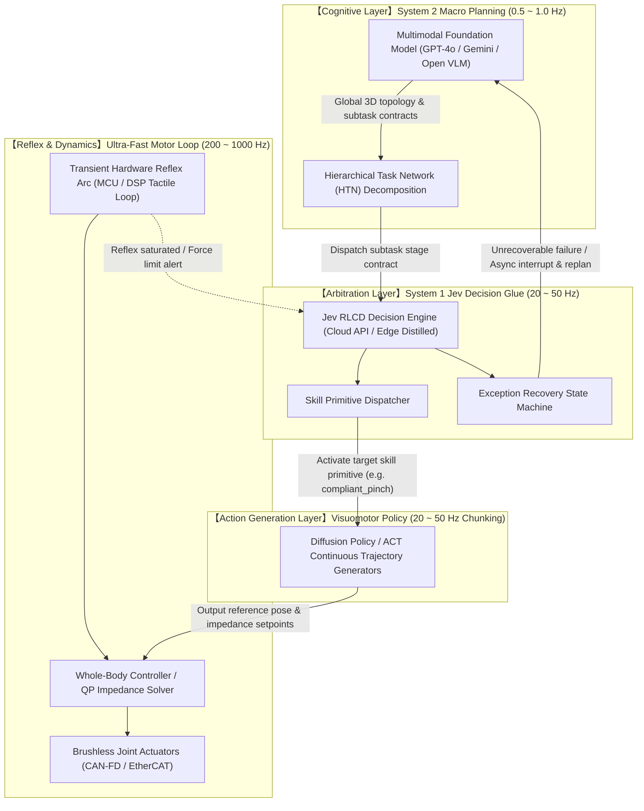
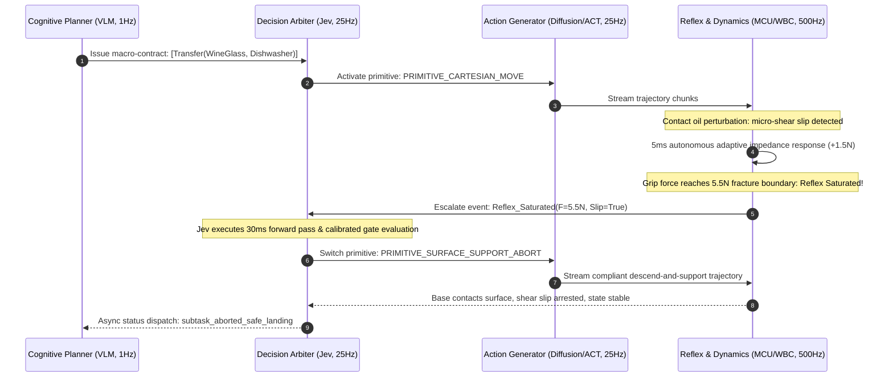

<div align="center">

**English | [简体中文](./README.md)**

# The Missing Middle: Bridging Semantic VLM Planning and Motor Control via System 1 Decision Models in Embodied AI

### *A Technical Blueprint for Hierarchical Robot Control via Calibrated Decision Engines*

[](./LICENSE)
[](https://docs.ros.org/)
[](#3-system-architecture-the-hierarchical-hybrid-control-framework)
[](#8-citation--project-specifications)

**Author**: `regou`  
**Domain**: Embodied AI · Hierarchical Control Theory · Real-Time Robotics · System 1 Decision Models  
**Version**: `v1.3.0-Technical-RFC` (September 2026)

</div>

---

## Abstract

As Embodied AI transitions from structured labs into open, unstructured physical environments, system architectures face a fundamental bottleneck: **The Control Chasm** (the semantic-dynamic decoupling):
* **Top-Level Vision-Language Models (VLMs)** possess broad open-world commonsense and long-horizon planning capabilities. However, single-inference latencies range from 1000 ~ 3000 ms, and autoregressive token generation exhibits stochastic drift and semantic hallucinations, making direct integration into high-frequency motor control loops intractable.
* **Low-Level Motor Control & Reflex Loops (WBC / Impedance Control / MCU)** operate at 200 ~ 1000 Hz with agile dynamic responsiveness, but remain semantics-blind and confined to localized numerical feedback loops.
* **Intermediate Action Policies (Diffusion Policy / ACT)** generate action chunks at 10 ~ 50 Hz, but their generalization boundaries remain fragile, lacking long-horizon state transition and exception recovery capabilities.
* Conventional stopgaps either rely on static **Behavior Trees (BTs)** that suffer from branch explosion and brittle failures in unstructured settings, or directly invoke **LLM Tool Calling**, which is hamstrung by severe network latency and parsing overhead.

In September 2026, TypeSafe AI (co-founded by former OpenAI scientist and RLHF co-inventor Diogo Almeida) introduced **Jev**, pioneering a specialized System 1 paradigm: **"Decisions, not strings."** Trained with **Reinforcement Learning for Calibrated Decisions (RLCD)**, Jev enables sub-50ms structured evaluations, mathematically calibrated confidence scores, the elimination of syntactic output drift, and single-pass parallel state arbitration.

This technical whitepaper formulates the **Hierarchical Hybrid Control Architecture**, systematically establishing the role of System 1 decision models as the indispensable **"cognitive glue and arbitration hub"** (The Missing Middle):
1. **Cognitive Planning Layer (0.5 ~ 1.0 Hz)**: High-level 3D semantic mapping and Hierarchical Task Network (HTN) decomposition via VLMs.
2. **Arbitration & Routing Layer (20 ~ 50 Hz)**: Jev decision engine (cloud prototype / edge-distilled) performing multimodal sensor fusion, skill primitive routing, and high-level action recovery.
3. **Continuous Trajectory Layer (20 ~ 50 Hz Chunking)**: Local action trajectory chunks generated via Diffusion Policy or ACT.
4. **Reflex & Dynamics Layer (200 ~ 1000 Hz)**: Low-level Cartesian impedance, QP-based Whole-Body Control (WBC), and transient hardware reflex arcs.

Through theoretical latency budgets and sequence walkthroughs—including fragile glassware transfer under reflex-saturating friction perturbations—this blueprint presents a standardized architectural paradigm uniting open-ended AI generalization with high-frequency deterministic action control.

---

## Table of Contents

- [1. Problem Formulation: The Control Chasm in Embodied AI](#1-problem-formulation-the-control-chasm-in-embodied-ai)
  - [1.1 Physical Limitations & Engineering Trade-offs of Current Paradigms](#11-physical-limitations--engineering-trade-offs-of-current-paradigms)
  - [1.2 Why Traditional Intermediate Glue Layers Fail](#12-why-traditional-intermediate-glue-layers-fail)
- [2. Jev Technical Mechanism: The System 1 Decision Paradigm](#2-jev-technical-mechanism-the-system-1-decision-paradigm)
  - [2.1 "Decisions, Not Strings": Rethinking the Computational Graph](#21-decisions-not-strings-rethinking-the-computational-graph)
  - [2.2 RLCD Confidence Calibration Mechanism](#22-rlcd-confidence-calibration-mechanism)
  - [2.3 Single-Forward Parallel Evaluation & Causal Masking](#23-single-forward-parallel-evaluation--causal-masking)
- [3. System Architecture: The Hierarchical Hybrid Control Framework](#3-system-architecture-the-hierarchical-hybrid-control-framework)
  - [3.1 End-to-End Architectural Dataflow](#31-end-to-end-architectural-dataflow)
  - [3.2 Four-Tier Functional Division & Frequency Decoupling](#32-four-tier-functional-division--frequency-decoupling)
  - [3.3 Action Routing & Dynamic Scheduling Principles](#33-action-routing--dynamic-scheduling-principles)
- [4. Benchmark Case Study: Reflex Saturation & High-Level Semantic Recovery](#4-benchmark-case-study-reflex-saturation--high-level-semantic-recovery)
  - [4.1 Task Specification: Thin-Walled Wine Glass Transfer](#41-task-specification-thin-walled-wine-glass-transfer)
  - [4.2 Low-Level Reflex vs. Jev Semantic Recovery Timeline](#42-low-level-reflex-vs-jev-semantic-recovery-timeline)
  - [4.3 Control Sequence Diagram](#43-control-sequence-diagram)
- [5. Interface Specifications & System Integration Design](#5-interface-specifications--system-integration-design)
  - [5.1 Strong-Typed Data Contracts](#51-strong-typed-data-contracts)
  - [5.2 Core Arbitration Mechanisms & Integration Pattern](#52-core-arbitration-mechanisms--integration-pattern)
- [6. Edge Deployment & Comprehensive Paradigm Comparison](#6-edge-deployment--comprehensive-paradigm-comparison)
  - [6.1 Deployment Roadmap: From Cloud API to On-Device Distillation](#61-deployment-roadmap-from-cloud-api-to-on-device-distillation)
  - [6.2 Comprehensive Paradigm Comparison Matrix](#62-comprehensive-paradigm-comparison-matrix)
- [7. Conclusion & Future Roadmap (2026 - 2028)](#7-conclusion--future-roadmap-2026---2028)
- [8. Citation & Project Specifications](#8-citation--project-specifications)

---

## 1. Problem Formulation: The Control Chasm in Embodied AI

In modern general-purpose robotics, a persistent architectural dichotomy exists between semantic cognition and physical dynamics:

```
┌──────────────────────────────────────────────────────────────┐
│             【Cognitive Layer】VLM / Multimodal LLM           │
│   Open-world commonsense, 3D topology, HTN planning (0.5 ~ 1.0 Hz)  │
└──────────────────────────────┬───────────────────────────────┘
                               │ 
                               │ ❌ The Missing Middle (The Control Chasm)
                               │    • 1000ms+ latency cannot resolve fast anomalies
                               │    • Autoregressive token drift and hallucinations
                               │    • Lack of calibrated epistemic confidence
                               │ 
┌──────────────────────────────▼───────────────────────────────┐
│           【Reflex & Dynamics】WBC / Impedance / MCU          │
│   Joint servoing, transient physical reflexes (200 ~ 1000 Hz) │
└──────────────────────────────────────────────────────────────┘
```

### 1.1 Physical Limitations & Engineering Trade-offs of Current Paradigms

Existing strategies to bridge this chasm offer distinct trade-offs, yet each hits clear engineering boundaries:

| Paradigm | Exemplar Frameworks | Operational Principle | Engineering Bottlenecks & Trade-offs |
| :--- | :--- | :--- | :--- |
| **Monolithic End-to-End VLA** | Google RT-2, OpenVLA | Raw pixels + instructions autoregressively output action tokens | **High latency (200 ~ 1000 ms)**; black-box behavior lacks intermediate explainability; cannot guarantee typed schema adherence; functional safety certification is near-impossible. |
| **Flow-Matching / Diffusion Policies** | Physical Intelligence π0, Diffusion Policy | Vision/point cloud observations generate multi-step action chunks (20 ~ 50 Hz) | **Weak multi-stage generalization**; policies overfit to local demonstration distributions; lack high-level semantic exception routing when novel physical disturbances occur. |
| **Classical Hierarchical Control** | Traditional Quadruped / Bimanual Industrial Systems | Modular pipeline: Global Perception → Trajectory Planning → Dynamics Tracking | **Rigid semantic coupling**; combinatorial state explosion in unstructured environments; unable to harness the open-world reasoning of foundation models. |

### 1.2 Why Traditional Intermediate Glue Layers Fail

Engineers have traditionally relied on two intermediate bridging approaches, both of which exhibit fundamental vulnerabilities in unstructured environments:

1. **Static Behavior Trees (BTs) & Finite State Machines (FSMs)**:
   - Demand exhaustive manual enumeration of conditional branching (`If-Else`);
   - In unstructured physical reality (friction variations, material fragility, dynamic occlusions), environmental state combinations grow exponentially, leading to deadlocks on unmodeled corner cases.
2. **LLM Function Calling / Tool Use**:
   - Instructs foundation models to output structured JSON control primitives;
   - **Latency Barrier**: SOTA models over cloud RTT impose 800 ~ 2500 ms latencies. In contact-rich manipulation, a multi-hundred-millisecond hesitation inevitably turns a transient slip into catastrophic drop;
   - **Syntactic Drift**: Autoregressive decoding cannot mathematically guarantee schema compliance; schema hallucinations crash downstream deterministic control pipelines.

---

## 2. Jev Technical Mechanism: The System 1 Decision Paradigm

Jev (developed by TypeSafe AI) departs from treating multimodal intelligence as an autoregressive text generator, reconstructing it as a high-throughput, deterministic **System 1 Decision Engine**.

### 2.1 "Decisions, Not Strings": Rethinking the Computational Graph

> [!IMPORTANT]
> **Fundamental Shift in Optimization**: Traditional LLMs optimize token-transition probabilities `P(Token_t | Token_<t)` across unconstrained vocabularies. Jev is a **decision arbiter**, optimizing discrete classification distributions over strongly typed schemas.

- **Non-Autoregressive Single Forward Pass**: Maps multimodal state embeddings directly to discrete enumerations, scalar scores, or boolean assertions in a single pass without token-by-token generation loops.
- **Syntactic Safety Guarantee**: Output spaces are topologically bounded within predefined primitive dictionaries and status enums, eliminating parsing errors and JSON format drift.
- **Ultra-Low Latency**: Bypassing token generation loops compresses inference latency to tens of milliseconds (20 ~ 40 ms), making it computationally compatible with real-time robot control loops.

### 2.2 RLCD Confidence Calibration Mechanism

Standard LLMs align to subjective human preferences via RLHF, often exacerbating overconfident hallucinations. Jev utilizes **Reinforcement Learning for Calibrated Decisions (RLCD)**.

In physical robotic control, overconfident misclassifications can be fatal. RLCD strictly enforces that the **model's predicted confidence directly matches the true empirical success rate**:
* **Calibration Principle (Epistemic Calibration)**: The predicted probability output by the model strictly matches its real-world empirical accuracy;
* **Minimizing Calibration Error (ECE)**: When Jev scores an action at 96% confidence, the empirical probability of physical failure or instability is statistically bounded at approximately 4%;
* This provides a verifiable foundation for downstream controllers, eliminating the danger of overconfident erroneous action dispatching.

### 2.3 Single-Forward Parallel Evaluation & Causal Masking

- **Parallel Head Evaluation**: Across a single unified state snapshot (proprioception, tactile metrics, visual grounding), Jev evaluates multiple orthogonal queries concurrently (e.g., obstacle proximity, contact limits, timeout events).
- **Hierarchical Causal Masking**: For decisions exhibiting temporal or logical dependencies (e.g., determining *anomaly type* before selecting *recovery strategy*), internal attention heads incorporate causal masking to prevent contradictory decisions.

---

## 3. System Architecture: The Hierarchical Hybrid Control Framework

### 3.1 End-to-End Architectural Dataflow



### 3.2 Four-Tier Functional Division & Frequency Decoupling

To eliminate architectural conflation, control responsibilities are structured across four decoupled time scales:

1. **Cognitive Planning Layer (0.5 ~ 1.0 Hz)**:
   - **Role**: Scene semantic interpretation, long-horizon task graph generation (HTN). It remains agnostic to millisecond sensor noise, issuing declarative stage contracts to the lower tiers.
2. **Arbitration & Routing Layer (The Missing Middle, 20 ~ 50 Hz)**:
   - **Role**: **The Core Cognitive-Executive Glue**. Ingests the macro-contract from above and sensor snapshots from below to perform:
     - Dynamic selection and invocation of atomic skill primitives;
     - Verification of calibrated confidence bounds;
     - High-level semantic state transitions when lower-level physical reflexes saturate.
3. **Action Generation Layer (20 ~ 50 Hz Chunking)**:
   - **Role**: Specialized Diffusion Policy or ACT networks converting visual tokens into smooth 16~64 step end-effector trajectories or joint targets.
4. **Reflex & Dynamics Layer (200 ~ 1000 Hz)**:
   - **Role**: Microcontrollers (MCU/DSP) executing closed-loop numerical dynamics (QP-WBC, Cartesian impedance control, micro-slip adaptive reflex) directly commanding motor current loops.

### 3.3 Action Routing & Dynamic Scheduling Principles

During every control cycle in the fast decision loop (20 ~ 50 ms), the system sequences and schedules skill primitives dynamically:

* **Primitive Selection & Dispatch**: Ingesting real-time perception snapshots, Jev queries the primitive library (e.g., Cartesian Move, Compliant Pinch, Surface Support, Damped Hold) to activate the optimal action primitive;
* **Dynamic Feedback Transitions**: Continuously monitors physical contact features to transition cleanly across primitives; when physical saturation occurs, it shifts primitives within 30ms to maintain fluid, un-interrupted multi-stage execution.


---

## 4. Benchmark Case Study: Reflex Saturation & High-Level Semantic Recovery

### 4.1 Task Specification: Thin-Walled Wine Glass Transfer

In an unstructured household environment:
* **Objective**: "Safely retrieve a partially filled, thin-walled crystal wine glass from a counter and place it securely into a dishwasher rack."
* **Physical Conflict**: The glass stem is contaminated with transparent cooking oil, causing an abrupt drop in surface friction coefficient μ. Insufficient grip force results in slippage; excessive grip force (> 6.0 N) shatters the fragile crystal.

### 4.2 Low-Level Reflex vs. Jev Semantic Recovery Timeline

This scenario exemplifies the clear functional boundary between low-level hardware reflex loops and intermediate semantic decision arbitration:

```
Timeline (ms)
├── 00 ms: [Perturbation Occurs] Oil film induces micro-shear slip at the fingertips.
├── 05 ms: [Low-Level Reflex Loop] Fingertip DSP tactile array detects high-frequency micro-vibrations;
│         the 500Hz impedance loop autonomously boosts normal force (+1.5N) within 5ms.
├── 25 ms: [Reflex Saturation] Normal force reaches 5.5N (approaching the 6.0N glass fracture limit),
│         yet slippage continues. The MCU reflex saturates and halts further force increments,
│         emitting a `Reflex_Saturated` event flag.
├── 30 ms: [Jev Ingestion] Snapshot containing force limits, tilt drift, and counter distance reaches Jev.
├── 60 ms: [Jev Semantic Arbitration (30ms pass)] Single-pass inference resolves:
│         ├─ is_reflex_saturated = True
│         ├─ select_recovery_primitive = PRIMITIVE_SURFACE_SUPPORT_ABORT (Confidence: 0.96)
│         └─ safety_gate_passed = True
├── 65 ms: [Recovery Execution] Manipulator halts upward lift and switches to a compliant lowering
│         primitive, supporting the base of the glass against the countertop.
└── 95 ms: [Stabilization] Countertop normal force arrests slippage completely; the glass is preserved
          without crushing or dropping.
```

> [!NOTE]
> **Architectural Significance**: Micro-slips are suppressed in **5ms** by low-level numerical reflexes. However, when physical constraints saturate, **Jev arbitrates high-level strategic recovery in 30ms**, preempting the catastrophic delay (1500 ms+) of escalating to a cloud VLM.

### 4.3 Control Sequence Diagram



---

## 5. Interface Specifications & System Integration Design

### 5.1 Strong-Typed Data Contracts

To guarantee zero format drift across heterogeneous runtimes, the fast decision layer enforces typed contracts:

#### Perception Snapshot (Input)
| Field Name | Type | Description |
| :--- | :--- | :--- |
| `macro_goal_id` | string | High-level task identifier (e.g., `"transfer_wine_glass"`) |
| `current_contract_stage` | string | Current task stage milestone (e.g., `"in_transit_lifted"`) |
| `tactile_slip_detected` | boolean | Binary flag indicating active shear displacement |
| `contact_normal_force_n` | float | Current resultant contact normal force (Newtons) |
| `reflex_force_limit_reached` | boolean | Flag indicating hardware reflex saturation |
| `end_effector_speed_mps` | float | Current tool-center-point velocity (m/s) |
| `joint_limit_proximity_pct` | float | Proximity percentage to kinematic joint limits (0 ~ 100) |
| `nearest_obstacle_distance_m` | float | Minimum distance to dynamic obstacles in workspace (meters) |

#### Decision Arbitration Result (Output)
| Field Name | Type | Description |
| :--- | :--- | :--- |
| `selected_primitive` | enum | Target skill primitive (e.g., Move / Grip Adjust / Surface Support / Emergency Hover) |
| `calibrated_confidence` | float | RLCD statistically calibrated confidence score (0.00 ~ 1.00) |
| `is_primitive_valid` | boolean | Primitive structural validation status |
| `request_vlm_replan` | boolean | Asynchronous trigger flag requesting VLM macro-replanning |

### 5.2 Core Arbitration Mechanisms & Integration Pattern

In concrete robotic implementations (such as ROS 2 nodes):
* **Decoupled Bidirectional Bus**: The decision arbiter runs on a deterministic 25 Hz timer, consuming processed sensor snapshots and publishing strongly typed primitive commands;
* **Non-Blocking Asynchronous Re-planning**: If confidence is low or a persistent physical anomaly is encountered, the arbiter immediately engages a safe hold mode and asynchronously emits a replanning event to the top-tier VLM, isolating real-time robot control from cloud latency.

---

## 6. Edge Deployment & Comprehensive Paradigm Comparison

### 6.1 Deployment Roadmap: From Cloud API to On-Device Distillation

To balance research agility with mobile power constraints, system development follows a two-stage trajectory:

1. **Current Prototyping (Cloud-Assisted Validation)**:
   - Evaluated via TypeSafe AI’s hosted Jev API (`api.typesafe.ai`) or OpenRouter endpoints for simulation-based action routing and protocol verification.
2. **Target Edge Deployment (Distilled On-Device Engine)**:
   - Transfer Jev's RLCD alignment and multi-head arbitration weights into compact, open-source multimodal backbones (0.5B ~ 1.5B parameters) via knowledge distillation;
   - Deploy as INT8/FP8 quantized engines on **NVIDIA Jetson Orin / Thor**, targeting an edge compute budget of **30W ~ 60W** with zero external network dependency.

### 6.2 Comprehensive Paradigm Comparison Matrix

| Evaluation Dimension | Monolithic VLA (RT-2 / OpenVLA) | Modular + Static Behavior Trees (BT) | Modular + LLM Tool Calling | **Hierarchical Hybrid + Jev Arbiter (Ours)** |
| :--- | :--- | :--- | :--- | :--- |
| **Action Switching Latency** | 200 ~ 1000 ms | < 5 ms | 800 ~ 2500 ms | **20 ~ 40 ms** |
| **Unstructured Generalization** | High (unstable on long-tail OOD) | Extremely Low (prone to branch deadlocks) | High (strong world commonsense) | **High (VLM reasoning + Jev adaptive routing)** |
| **Syntactic Output Stability** | Susceptible to floating-point drift | Absolute (hard-coded) | Poor (occasional JSON parsing failures) | **High (enforced type-safe discrete schemas)** |
| **Action Execution Determinism**| Low (continuous action jitter) | Extremely High (deterministic branches) | Low (prompt drift & hallucinations) | **High (strongly-typed primitive adherence)** |
| **Slip Perturbation Recovery** | Slow (relies on visual feedback) | Requires exhaustive manual branches | Incapable of real-time compensation | **Decoupled (5ms reflex + 30ms semantic arbitration)** |

---

## 7. Conclusion & Future Roadmap (2026 - 2028)

This technical whitepaper articulates the necessity of **System 1 decision models as "The Missing Middle" in embodied robotic architectures**:
1. **Bridging Semantic & Physical Latencies**: Decoupling the control hierarchy across four distinct temporal tiers preserves foundation model generalization while shielding high-frequency motor loops from catastrophic inference delays.
2. **Deterministic Action Guarantees**: Coupling strong-typed data contracts with RLCD confidence calibration provides robots with fluid, dependable primitive transitions in uncertain physical environments.

### Technical Roadmap (2026 - 2028)

```
2026 Q4: [Standardization & Simulation Environments] 
 └── Open-source ROS 2 / Isaac Lab hierarchical decision middleware packages
 └── Release benchmark suites evaluating Jev-guided arbitration in bimanual manipulation

2027 Q2: [Edge Distillation & TensorRT Acceleration] 
 └── Release multi-head RLCD distillation recipes for 0.5B-1.5B edge backbones
 └── Validate sub-30ms closed-loop execution on Jetson Thor NPU platforms

2027 Q4: [Cross-Modal Multimodal Arbitration]
 └── Ingest raw 3D tactile point clouds directly into decision attention layers
 └── Achieve 100+ step fault-tolerant autonomous manipulation runs in complex environments
```

---

## 8. Citation & Project Specifications

This technical RFC is authored and maintained by `regou`. To cite this document in academic, industrial, or open-source research, please use the following BibTeX entry:

```bibtex
@techreport{regou_embodied_missing_middle_2026,
  title       = {The Missing Middle: Bridging Semantic VLM Planning and Motor Control via System 1 Decision Models in Embodied AI},
  author      = {regou},
  year        = {2026},
  institution = {Embodied AI Architecture Working Group},
  howpublished = {\url{https://github.com/regou/jev_the_missing_middle}}
}
```

<div align="center">

**Author: `regou` · Released under Apache 2.0 License**

</div>
